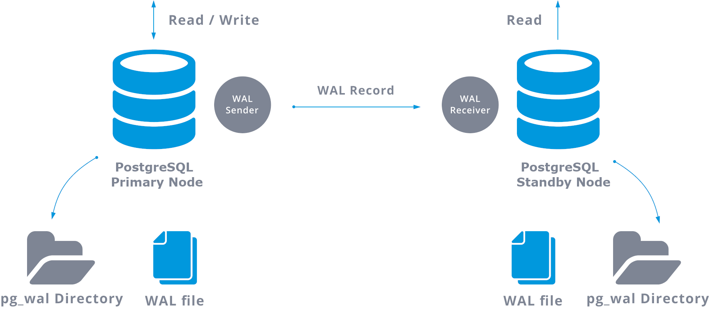

# PostgreSQL en système distribué

*Timothée Van Hove et Samuel Roland*

 

---

## Introduction
description factuelle des possibilités avec PGSQL et Citus.

---

## Réplication

### Replication dans PGSQL

### Qu’est-ce que la Streaming Replication ?

**Speaker notes**

La streaming replication de PostgreSQL, la plus courante, est une réplication physique qui réplique les changements au niveau byte par byte, créant une copie identique de la base de données sur des autres serveurs.

C'est une réplication à **leader unique** qui fonctionne en transmettant les journaux WAL (Write-Ahead Logging) depuis le leader vers les répliques via une connexion réseau.

Les followers reçoivent ces journaux de manière quasi-continue, ce qui permet de maintenir leur état aussi proche que possible de celui du leader.

Un processus appelé WAL receiver, fonctionnant sur le serveur répliqué, se connectera au serveur primaire à l'aide d'une connexion TCP. 

Sur le serveur primaire, il existe un autre processus, appelé WAL sender, qui est chargé d'envoyer les registres WAL au serveur de secours au fur et à mesure.

**Slides**

- Réplication la plus courante (leader unique)
- Utilise les journaux WAL pour synchroniser les followers (standby nodes) avec le leader (primary node).
- Les followers recoivent les journeaux WAL de manière quasi-continue

### Streaming Replication - Modes

**Speaker notes**

Il existe deux modes de Streaming replication, synchrone et asynchrone.

* Synchrone: Si une réplique distante se trouve sur un autre continent ou utilise une connexion réseau lente, la latence peut augmenter considérablement le temps nécessaire pour valider les transactions. Cela peut affecter les performances globales du système. **Cas d’usage : Systèmes critiques (ex. : banques).**
* Asynchrone: Les répliques peuvent accumuler un léger retard (replication lag), mais elles restent proches du leader si les ressources réseau et matérielles sont suffisantes. **Cas d’usage : Applications tolérant des incohérences temporaires (ex. : réseaux sociaux).**
* Réplication en cascade: Si on a beaucoup de répliques, envoyer directement les journaux à chacune peut surcharger le Primary Server. En utilisant la cascade, certains folowers agissent comme relais. **Cas d'usage** : Dans des environnements distribués géographiquement, un Standby Server intermédiaire peut être positionné plus près des autres serveurs pour minimiser la latence réseau.

**Slides**

* Mode Synchrone
  * Le Primary Server (Leader) attend la confirmation des répliques avant de valider une transaction.
* Mode Asynchrone
  * Le Primary Server (Leader) n'attend pas de confirmation des répliques ; il envoie les WAL dès qu'ils sont générés.
* Réplication en cascade
  * Un Standby Server (Follower) peut avoir le charge d'envoyer les WAL à d'autres followers. On parle de "Sending server"
  * ça permet de réduire la charge du leader

### Qu’est-ce que la Logical Replication ?

**Speaker notes**

* La réplication logique réplique les données au niveau des lignes et des colonnes. Contrairement à la Streaming replication, elle ne copie pas les blocs de données au niveau byte, mais les modifications au niveau logique.
* Elle fonctionne sur le principe publisher-subscriber:
  * **Publisher** : Définit des publications (ensembles de données et types de changements à répliquer).
  * **Subscriber** : Souscrit à une ou plusieurs publications et applique les changements.

**Slides**

- Réplique les modifications au niveau des transactions (lignes/tables spécifiques).
- Fonctionne via des **publishers** et des **subscribers**.
- Permet une réplication personnalisée (par exemple, seulement certaines tables).
- Avantages :
  - Permet de répliquer des tables spécifiques ou des sous-ensembles de données.
  - Fonctionne entre différentes versions PGSQL et OS, utile pour des mises à jour progressives ou des migrations.
- Limites:
  -  Les modifications locales sur le Subscriber peuvent entraîner des conflits avec les données répliquées.
  -  Les changements de schéma ne sont pas répliqués automatiquement.

### Comment fonctionne la Logical Replication ?

**Speaker notes**

- Le **processus wal sender** côté Publisher extrait les modifications à partir du WAL.
- Il utilise un **plugin de décodage logique** (`pgoutput` par défaut) pour traduire ces modifications en un format compréhensible pour la réplication logique.
- Les modifications sont ensuite envoyées aux subscribers

- **Le processus apply worker** sur le Subscriber reçoit les modifications.
- Il les mappe aux tables locales et applique chaque modification dans le même ordre transactionnel que sur le Publisher.

**Slides**

- Le Publisher transforme le WAL en opérations transactionnelles
- Les informations sont envoyées aux subscribers
- Les schémas doivent être identiques ou compatibles entre Publisher et Subscriber.

### Streaming vs Logical Replication

**Streaming Replication**

- Réplication physique, type Leader-Follower (primary et standbys)
- Objectif : Maintenir une copie exacte de la base pour haute disponibilité et basculement.
- Avantages :
  - Simple à configurer.
  - Faible latence, idéal pour la continuité des services critiques.
- Limites :
  - Réplique toute la base.
  - Pas de personnalisation ou de filtrage des données.

**Logical Replication**

- Réplication logique type Publish-Subscribe
- Objectif : Partager des données spécifiques
- Avantages :
  - Flexible, permet de cibler des tables ou types de modifications.
  - Compatible entre versions ou plateformes.
- Limites :
  - Conflits possibles en cas d'écritures locales sur le Subscriber.
  - Schéma et séquences non répliqués automatiquement.

### "Réplication multi-leader ? Bi-Directional Replication"

**Speaker notes**

BDR est une extension conçue pour offrir la réplication multi-leader. Dans ce modèle, plusieurs nœuds peuvent agir comme leaders, chacun acceptant des écritures. ça permet une répartition des charges d'écriture.

BDR se base sur la réplication logique. Chaque modification effectuée sur un nœud est répliquée aux autres, et les conflits potentiels sont gérés grâce à un système de détection et de résolution des conflits.

Les conflits apparaissent lorsque deux nœuds modifient simultanément une même ligne. Par défaut, BDR applique un résolveur appelé `update_if_newer`, qui conserve la version la plus récente basée sur le timestamp de commit. Si les timestamps sont identiques, l'ID du nœud est utilisé comme critère de départage.

**Slide**

PGSQL ne supporte pas la réplication multi-leader nativement.  BDR est une extension pour la réplication multi-leader basée sur le logical replication:

- Chaque nœud agit comme un leader capable d’accepter des écritures
- Les conflits d’écriture sont détectés lorsque plusieurs nœuds modifient les mêmes données.
- Utilise des résolveurs de conflits pour déterminer comment gérer ces situations.
  - Par défaut, BDR applique le résolveur `update_if_newer`, qui conserve la version de la ligne ayant le timestamp de commit le plus récent.

**Avantages :**

- Partage de la charge d’écriture entre plusieurs nœuds.
- Résilience : chaque leader peut agir comme un secours.

**Limites :**

- Complexité : gestion des conflits entre les nœuds.
- Licence commerciale et non open-source complète.

---

## Partionnement et sharding

